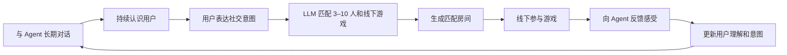
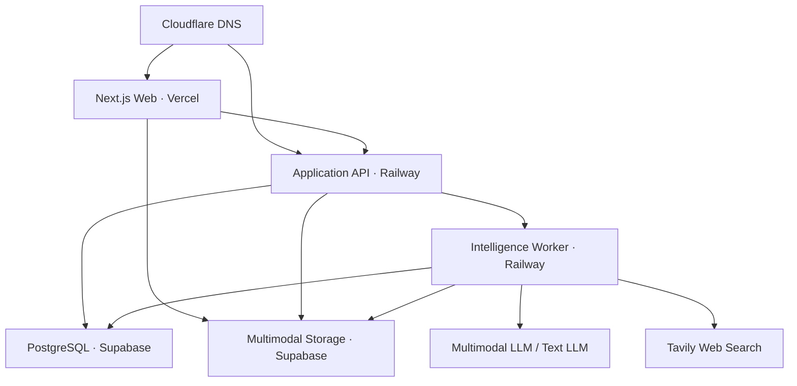

# TOMEET 总体技术方案

TOMEET 是一个可以长期对话的社交 Agent。

Agent 通过用户主动提供的文本、图片、短录音和持续对话认识用户。当用户想社交时，系统使用 LLM 匹配合适的 3–10 人，并从人工策划的线下游戏中选择合适的游戏。活动结束后，用户向 Agent 反馈感受，Agent 据此持续对齐用户意图。

## 当前实现

仓库已经包含可运行的初步框架，并保持前后端分离：

- `apps/api`：Fastify API，部署到 Railway。
- `apps/intelligence-worker`：支持多并发槽位的智能任务 Worker，部署到 Railway。
- `apps/web`：只用于本地联调的简洁测试台，不替代现有 Vercel 前端。
- `packages/*`：契约、Agent、用户模型、匹配、游戏目录、房间、反馈、数据访问和任务编排。
- `supabase/migrations`：业务表、索引、私有 Storage Bucket 和并发安全 RPC。

Supabase 是正式持久化路径。内存 Store 只用于自动测试和 `DEMO_MODE` 本地预览。

## 本地快速预览

仓库要求 Node.js 22 或更高版本，并通过 `packageManager` 固定使用 pnpm 10.14.0。仓库根目录的 `.nvmrc` 可用于切换 Node.js 主版本；首次运行前启用 Corepack：

```bash
nvm use 22
corepack enable
pnpm --version
```

`pnpm --version` 应输出 `10.14.0`。不要使用 Node.js 20 或未锁定版本的包管理器生成 lockfile。

无需 Supabase 凭据即可先验证完整流程：

```bash
pnpm install --frozen-lockfile
cp .env.example .env
```

将 `.env` 中的 `DEMO_MODE` 改为 `true`，然后运行：

```bash
pnpm dev
```

- 本地测试台：`http://localhost:3000`
- API：`http://localhost:4000`

本地页面提供聊天和图片入口。用户可以通过文字与图片持续形成多模态 vibe，完成表达社交意图、自动匹配、确认房间、标记活动完成和提交活动反馈。

当前 `.env.example` 默认使用真实硅基流动模型。填写 `LLM_API_KEY` 后，使用以下组合可以在不接 Supabase 的情况下做真实模型场景测试：

```text
DEMO_MODE=true
LLM_API_BASE_URL=https://api.siliconflow.cn/v1
LLM_TEXT_MODEL=Qwen/Qwen3-Omni-30B-A3B-Instruct
LLM_VISION_MODEL=Qwen/Qwen3-Omni-30B-A3B-Instruct
TAVILY_API_KEY=...
```

这时只有业务数据和测试成员保存在内存中，Agent 理解、图片理解、动作识别、组人和游戏选择全部由真实模型完成。运行时不提供 Mock 模型；Mock 只存在于自动测试代码中。

## 连接托管 Supabase

1. 创建 Supabase 项目。
2. 使用 Supabase CLI 将迁移推送到该项目：

```bash
supabase login
supabase link --project-ref <project-ref>
supabase db push
```

3. 如需单人走通匹配，在开发项目的 SQL Editor 执行 `supabase/seed.sql`。这些种子成员只用于测试，会自动确认房间。
4. 配置 API 和 Worker 的 `SUPABASE_URL`、`SUPABASE_SERVICE_ROLE_KEY`。
5. API 使用 `DEMO_MODE=false`，Worker 必须配置真实模型。

使用真实托管模型时设置：

```text
LLM_API_KEY=...
LLM_API_BASE_URL=https://api.siliconflow.cn/v1
LLM_TEXT_MODEL=Qwen/Qwen3-Omni-30B-A3B-Instruct
LLM_VISION_MODEL=Qwen/Qwen3-Omni-30B-A3B-Instruct
LLM_AUDIO_MODEL=FunAudioLLM/SenseVoiceSmall
TAVILY_API_KEY=...
TAVILY_API_BASE_URL=https://api.tavily.com
```

LLM 适配器采用 OpenAI 兼容的 Chat Completions HTTP 边界，当前已通过硅基流动 `Qwen/Qwen3-Omni-30B-A3B-Instruct` 的文本、图片和 JSON 输出验证。

Agent 会先生成受约束的搜索计划。明确要求联网、询问实时信息或出现无法可靠识别的专名时，Worker 使用 Tavily 搜索，再让模型只依据搜索证据生成回复，并由代码追加来源 URL。普通聊天、稳定常识和单纯的社交意图不会调用搜索。未配置 `TAVILY_API_KEY` 时服务仍可启动，但 Agent 会明确说明无法联网核实，不会根据模型记忆猜测实时事实。

真实模型会输出受约束的结构化动作：`start_match`、`confirm_room`、`complete_room`、`submit_feedback`。Worker 执行动作前仍会通过领域规则和 Supabase RPC 校验，模型不能绕过房间状态或匹配约束。

## Railway 部署

在同一个 Railway Project 创建两个 Service，均连接此仓库根目录：

### API Service

- Config file：`/railway.api.toml`
- 环境变量：`SUPABASE_URL`、`SUPABASE_SERVICE_ROLE_KEY`、`FRONTEND_ORIGIN`、`DEMO_MODE=false`
- `FRONTEND_ORIGIN` 支持逗号分隔多个来源，例如本地测试台和现有 Vercel 域名。
- Railway 通过 `/health` 做存活检查，通过 `/ready` 检查 Supabase 连接。

### Intelligence Worker Service

- Config file：`/railway.worker.toml`
- 环境变量：`SUPABASE_URL`、`SUPABASE_SERVICE_ROLE_KEY`、真实模型配置和用于联网搜索的 `TAVILY_API_KEY`。
- `WORKER_CONCURRENCY` 默认 `8`，单实例最大允许 `32`；也可以在 Railway 横向增加副本。

Worker 使用 Supabase PostgreSQL 的 `FOR UPDATE SKIP LOCKED` 领取任务。多槽位和多副本不会重复领取同一任务；失败任务使用指数退避，进程中断后的锁会自动回收。

## 现有 Vercel 前端接入

现有前端只需将 API Base URL 指向 Railway API 域名，并按照 [API 契约](docs/api.md) 调用。需要 LLM 的接口可能返回 `202`，前端轮询 `/jobs/:id` 或匹配请求状态即可。

## 并发与一致性

- 一个用户只能存在一个活跃匹配请求，由部分唯一索引保证。
- LLM 任务通过唯一幂等键去重。
- Worker 使用 `SKIP LOCKED` 并发领取任务。
- 建房在单个数据库事务内锁定全部匹配请求，并再次校验等待状态、成员对应关系、重复成员和游戏人数范围。
- 重叠匹配并发发生时，只有第一个事务能成功分配成员。
- 建房记录 `source_job_id`，Worker 在建房后异常重试不会创建重复房间。
- 用户模型采用版本号乐观锁，冲突时 Worker 自动重新读取并重试。
- 房间确认、活动完成和反馈写入均在 Supabase RPC 内校验状态并原子提交。

## 工程验证

```bash
pnpm lint
pnpm typecheck
pnpm test
pnpm build
pnpm check
```

`pnpm check` 按 lint、typecheck、test、build 的顺序执行，是本地和后续 CI 的统一质量门禁。

当前测试覆盖完整核心流程、同一用户 50 个并发匹配请求去重、32 个 Worker 槽位任务领取不重复，并会在 PGlite 轻量 PostgreSQL 内核中执行 Supabase migrations 和关键 RPC。PGlite 测试属于 migration/RPC smoke，不等同于本地 Supabase Auth、RLS、Storage 或 Realtime 集成测试；详细基线和缺口见 [`docs/qa-baseline.md`](docs/qa-baseline.md)。

验证真实模型的结构化动作和匹配约束：

```bash
pnpm --filter @tomeet/intelligence-worker smoke:llm
```

该检查会真实调用配置的模型，验证发起匹配、确认房间、完成活动、反馈整理，以及匹配结果必须包含触发用户。

同时配置 `LLM_API_KEY` 和 `TAVILY_API_KEY` 后，可以验证真实联网搜索、证据引用和 AdventureX 官方来源：

```bash
pnpm --filter @tomeet/intelligence-worker smoke:web-search
```

安装 [k6](https://grafana.com/docs/k6/latest/set-up/install-k6/) 后可运行基础 API 压测：

```bash
API_BASE_URL=https://your-api.up.railway.app k6 run tests/load/k6-api.js
```

## 1. 产品流程

产品流程描述用户如何使用 TOMEET，不代表系统架构。



## 2. 系统架构



采用单仓库、模块化单体和独立智能任务 Worker：

- Vercel 运行前端。
- Railway 运行 API 服务和 Intelligence Worker。
- Supabase 保存业务数据和多模态原文件。
- Cloudflare 只负责域名 DNS 解析。
- LLM 负责用户理解、长期记忆更新、组人和游戏选择。
- Tavily 只接收模型生成的短搜索查询，为实时外部事实提供网页证据。

## 3. 核心模块

### Agent Core

- 维护用户与 Agent 的长期对话。
- 组装最近对话、当前意图、长期用户理解和历史反馈。
- 调用 LLM 生成回复。
- 通过对话确认用户当前社交意图。

### User Model

保存 Agent 对用户的持续理解：

- `VibeNarrative`：由文字、图片、录音和真实活动反馈持续改写的一段整体叙事，不是标签集合。
- `LongTermProfile`：长期兴趣、偏好和互动方式。
- `CurrentIntent`：用户当前的社交意图。
- `SocialHistory`：历史匹配和线下游戏。
- `FeedbackMemory`：用户对人群、游戏和连接结果的反馈。
- `MultimodalUnderstanding`：对文本、图片和短录音的结构化理解与摘要。

上下文由最近对话、滚动摘要、结构化用户模型和历史反馈组成。

### LLM Matchmaking

只有当用户明确表达想社交时，系统才创建 `MatchRequest`。

LLM 匹配任务只读取无标签 vibe 输入：

- 当前等待中的匹配请求。
- 每位用户本次表达社交意图时的原话。
- 文字、图片、录音与反馈共同形成的连续 `VibeNarrative`。
- 多模态理解中的自然语言 vibe 片段。
- 人工策划游戏的说明、人数、条件和执行过程。

兴趣标签、`intentTags`、`traits`、性格类型、人口属性、关键词计数和标签分数都不会进入匹配模型输入。游戏目录可以保留运营元数据，但匹配只看到自然语言体验说明与硬性人数条件。

LLM 输出结构化 `MatchDecision`：

- 3–10 名成员。
- 选中的线下游戏。
- 匹配判断摘要。

系统校验成员仍在等待、没有重复分配、人数符合要求、游戏适合该人数后创建房间。

### Offline Game Catalog

线下游戏由策划人员提前录入，Agent 和 LLM 只能选择已有游戏。

每个游戏保存：

- 游戏名称和说明。
- 最少与最多参与人数。
- 适合的社交意图。
- 体验特点和参与条件。
- 线下执行说明。

### Match Room

匹配房间只保存：

- 3–10 名成员。
- 选中的线下游戏。
- 成员确认状态。
- 活动完成状态。

房间不承载在线游戏过程。

### Post-event Feedback

活动结束后，用户通过 Agent 表达：

- 对本次人群的感受。
- 对线下游戏的感受。
- 是否建立了想继续发展的连接。
- 下一次希望保持或改变什么。

LLM 将反馈整理进 `FeedbackMemory`，并继续改写 `VibeNarrative`、`LongTermProfile` 和 `CurrentIntent`。

## 4. 后台任务

Railway 上的 Intelligence Worker 处理：

- 文本、图片和短录音理解。
- Agent 回复生成。
- 用户模型和长期记忆更新。
- LLM 组人和线下游戏选择。
- 活动后反馈整理。

任务写入 Supabase 的 `llm_jobs` 表。Worker 使用数据库锁领取任务，执行完成后写回结果和状态，不增加额外队列服务。

## 5. 核心数据表

```text
users
conversations
messages
user_models
multimodal_inputs
match_requests
match_rooms
room_members
offline_games
post_event_feedback
llm_jobs
```

关键关系：

```text
User
 ├── Conversation → Messages
 ├── UserModel
 ├── MultimodalInputs
 ├── MatchRequests
 └── PostEventFeedback

MatchRequest
 └── MatchRoom
      ├── RoomMembers
      ├── OfflineGame
      └── PostEventFeedback
```

## 6. 核心类型

```ts
export interface UserModel {
  userId: string;
  vibeNarrative: string;
  longTermProfile: Record<string, unknown>;
  currentIntent: Record<string, unknown>;
  socialHistory: string[];
  feedbackMemory: string[];
  multimodalUnderstanding: Record<string, unknown>;
  version: number;
}

export interface MatchRequest {
  requestId: string;
  userId: string;
  intentSnapshot: Record<string, unknown>;
  status: "matching" | "matched" | "cancelled";
}

export interface MatchDecision {
  memberIds: string[];
  offlineGameId: string;
  summary: string;
}

export interface MatchRoom {
  roomId: string;
  memberIds: string[];
  offlineGameId: string;
  status: "confirming" | "confirmed" | "completed";
}

export interface PostEventFeedback {
  userId: string;
  roomId: string;
  peopleFeedback: string;
  gameFeedback: string;
  connectionUserIds: string[];
  nextIntent: string;
}
```

## 7. API

```text
POST /agent/messages
POST /agent/multimodal-inputs

POST /match-requests
GET  /match-requests/:id
POST /match-requests/:id/cancel

GET  /rooms/:id
POST /rooms/:id/confirm
POST /rooms/:id/complete
POST /rooms/:id/feedback
```

前端通过轮询获取匹配状态。Agent 回复可以使用普通请求或 SSE 流式返回。

## 8. 模板仓库结构

```text
tomeet/
├── apps/
│   ├── web/                       # Next.js 本地测试台；正式前端已在 Vercel
│   ├── api/                       # API 服务，部署到 Railway
│   └── intelligence-worker/       # 智能任务，部署到 Railway
├── packages/
│   ├── contracts/
│   ├── agent-core/
│   ├── user-model/
│   ├── matchmaking/
│   ├── game-catalog/
│   ├── room/
│   ├── feedback/
│   ├── data/                      # Supabase / 内存数据适配器
│   └── intelligence/              # 后台任务编排
├── supabase/
│   └── migrations/
├── docs/
│   ├── product-flow.md
│   └── architecture.md
├── tests/
│   └── core-flow/
├── .env.example
├── package.json
├── pnpm-workspace.yaml
└── README.md
```

## 9. 部署

### Supabase

- 创建 PostgreSQL 项目。
- 执行 `supabase/migrations`。
- 创建保存图片和短录音的 Storage Bucket。
- Railway 使用服务端数据库连接和 Service Role Key。
- Vercel 只使用公开配置或后端生成的上传授权。

### Railway

在同一个 Railway Project 中创建两个 Service：

- `api`：运行 `apps/api`。
- `intelligence-worker`：运行 `apps/intelligence-worker`。

两个 Service 连接同一个 Supabase 项目。

### Vercel

- 继续使用已经部署的正式前端项目。
- 将 `NEXT_PUBLIC_API_BASE_URL` 指向 Railway API 域名。
- 图片和短录音上传需要 Supabase 公开配置，但 Service Role Key 只能留在 Railway。
- 本仓库的 `apps/web` 只在本地用于接口联调。

### Cloudflare DNS

Cloudflare 管理域名解析：

```text
@ / www / app  → Vercel 提供的域名记录
api            → Railway 提供的域名记录
```

初始使用 `DNS only`，HTTPS 证书由 Vercel 和 Railway 自动签发。

## 10. 环境变量

### Vercel

```text
NEXT_PUBLIC_API_BASE_URL
NEXT_PUBLIC_SUPABASE_URL
NEXT_PUBLIC_SUPABASE_ANON_KEY
```

### Railway API

```text
DATABASE_URL
SUPABASE_URL
SUPABASE_SERVICE_ROLE_KEY
LLM_API_KEY
FRONTEND_ORIGIN
```

### Railway Intelligence Worker

```text
DATABASE_URL
SUPABASE_URL
SUPABASE_SERVICE_ROLE_KEY
LLM_API_KEY
TAVILY_API_KEY
```

## 11. 完成标准

- Agent 能通过长期对话和多模态输入持续认识用户。
- 用户表达社交意图后，系统能创建匹配请求。
- LLM 能匹配 3–10 人并选择一款已有线下游戏。
- 系统能创建房间并完成成员确认。
- 活动结束后，用户能向 Agent 反馈感受和连接结果。
- 反馈能更新用户意图，并影响下一次匹配和游戏选择。

## 详细文档

- [产品流程](docs/product-flow.md)
- [系统架构](docs/architecture.md)
- [API 契约](docs/api.md)
