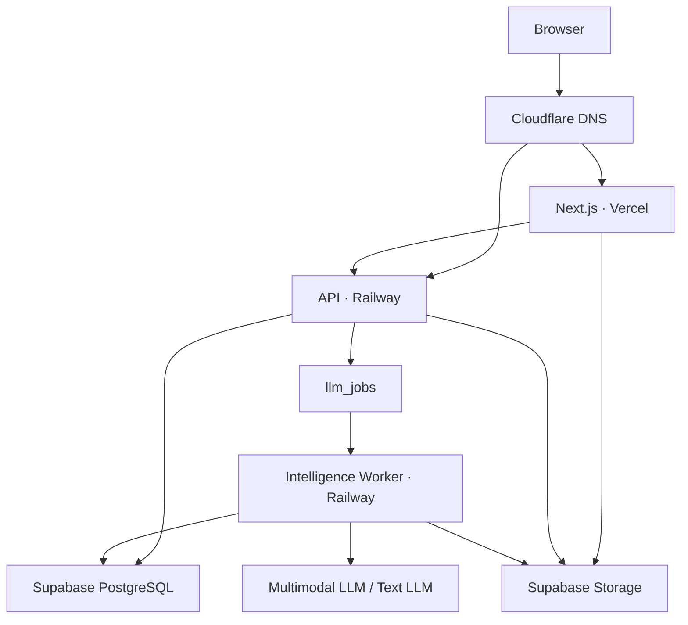
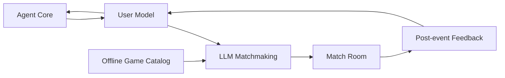

# TOMEET 系统架构

本文只描述系统组件、部署关系和数据边界。用户流程见 [product-flow.md](product-flow.md)。

## 部署架构



## 运行单元

### Vercel Web

负责：

- 长期 Agent 对话界面。
- 文本、图片和短录音输入。
- 发起匹配和查看房间。
- 提交活动后反馈。

### Railway API

负责：

- Agent、匹配、房间和反馈 API。
- 业务规则和数据写入。
- 创建 LLM 后台任务。
- 校验 LLM 输出并创建房间。

### Railway Intelligence Worker

负责：

- 多模态用户理解。
- Agent 回复生成。
- 用户模型和长期记忆更新。
- LLM 组人和线下游戏选择。
- 活动后反馈整理。

### Supabase

负责：

- PostgreSQL 业务数据。
- 多模态文件保存。
- `llm_jobs` 后台任务表。
- 事务锁与并发控制。

### Cloudflare

只负责 DNS 解析：

- 前端域名指向 Vercel。
- API 域名指向 Railway。

## 逻辑模块



## Agent 与上下文

Agent 每次响应时组装：

- 最近对话。
- 对话滚动摘要。
- `LongTermProfile`。
- `CurrentIntent`。
- 相关历史匹配和反馈。
- 由文字、图片、录音和反馈持续更新的 `VibeNarrative`。

多模态输入由真实多模态 LLM 整理为摘要和连续 vibe 叙事，写入 `UserModel`。运行时不提供 Mock 模型。

## LLM 匹配

匹配任务读取当前等待中的 `MatchRequest`、用户表达当前社交意图的原话、连续 `VibeNarrative`、多模态 vibe 片段和已有线下游戏的自然语言说明。

匹配输入明确排除兴趣标签、`intentTags`、`traits`、性格分类、人口属性、关键词计数和标签分数。LLM 只能根据多模态材料形成的整体表达节奏、能量、关系距离和可能的线下互动流动做判断。

LLM 直接输出：

- 3–10 名成员。
- 一款已有线下游戏。
- 匹配判断摘要。

API 在事务中校验请求仍然有效、成员没有重复分配、人数符合要求、游戏支持该人数，然后写入 `MatchRoom` 和 `RoomMembers`。

## 后台任务

所有 LLM 任务写入 Supabase 的 `llm_jobs` 表。

Worker 使用 `FOR UPDATE SKIP LOCKED` 领取待执行任务，避免同一任务被重复处理。任务完成后保存结构化结果；失败时记录错误并按重试次数重新执行。

## 数据边界

```text
Agent Core
 └── conversations / messages

User Model
 └── user_models / multimodal_inputs

LLM Matchmaking
 └── match_requests / llm_jobs

Offline Game Catalog
 └── offline_games

Match Room
 └── match_rooms / room_members

Post-event Feedback
 └── post_event_feedback
```

## 域名

```text
app.example.com → Vercel
api.example.com → Railway
```

Cloudflare 初始使用 `DNS only`，证书由 Vercel 和 Railway 管理。
