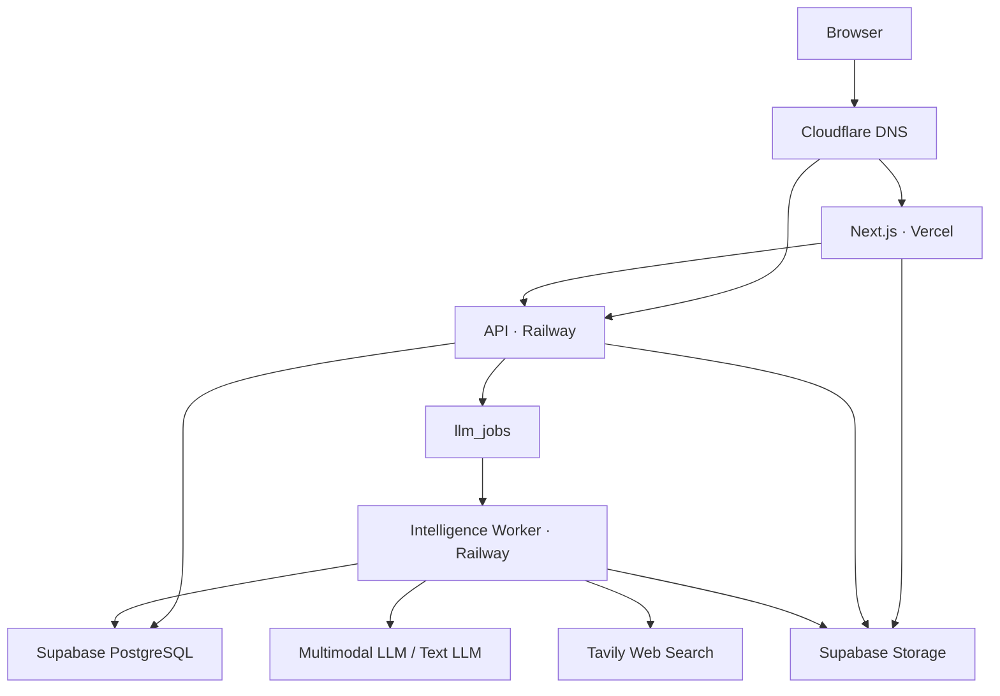
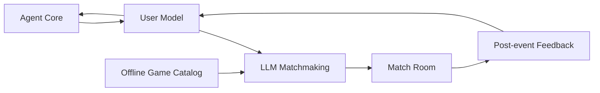

# TOMEET 系统架构

本文只描述系统组件、部署关系和数据边界。用户流程见 [product-flow.md](product-flow.md)。

## 部署架构



## 运行单元

### Vercel Web

负责：

- 长期 Agent 对话界面。
- 文本、图片和短录音输入。
- 发起匹配和查看房间。
- 提交活动后反馈。

### Railway API

负责：

- Agent、匹配、房间和反馈 API。
- 业务规则和数据写入。
- 创建 LLM 后台任务。
- 校验 LLM 输出并创建房间。

### Railway Intelligence Worker

负责：

- 多模态用户理解。
- Agent 回复生成。
- 用户模型和长期记忆更新。
- LLM 组人和线下游戏选择。
- 活动后反馈整理。
- 对实时信息和陌生专名生成搜索计划、获取网页证据，并在发布前校验候选回复；来源仅保留在结构化元数据中，不进入 Agent 消息正文。

### Supabase

负责：

- PostgreSQL 业务数据。
- 多模态文件保存。
- `llm_jobs` 后台任务表。
- 事务锁与并发控制。

### Cloudflare

只负责 DNS 解析：

- 前端域名指向 Vercel。
- API 域名指向 Railway。

## 逻辑模块



## Agent 与上下文

Agent 每次响应时组装：

- token-budgeted 最近对话（最多 16 条）。
- 可替换的短 checkpoint。
- 隐藏的 `profileNarrative` 摘要。
- 按当前问题检索的最多 6 条详细记忆。
- `CurrentIntent`、匹配请求和房间运行状态。

当前用户消息通过 `userMessageId` 从历史中排除后单独传入。旧 `LongTermProfile`、`VibeNarrative`、完整多模态记录和反馈数组不再进入 Agent prompt。

Agent 首轮只冻结回复草稿、当前意图、产品 action、记忆检索计划和联网计划。记忆检索与联网证据随后进入 finalizer；finalizer 只能改写回复并报告实际使用的证据，不能改变 action。多模态输入只能形成有期限的近期印象，不能自动写成稳定个人事实。

完整设计见 [Agent Memory / Context V2](agent-memory-context.md)。

## LLM 匹配

匹配任务读取当前等待中的 `MatchRequest`、用户表达当前社交意图的原话、经过记忆治理的 `matchingNarrative` 和已有线下游戏的自然语言说明。

匹配输入明确排除兴趣标签、`intentTags`、`traits`、性格分类、人口属性、关键词计数和标签分数。LLM 只能根据多模态材料形成的整体表达节奏、能量、关系距离和可能的线下互动流动做判断。

LLM 直接输出：

- 3–10 名成员。
- 一款已有线下游戏。
- 匹配判断摘要。

API 在事务中校验请求仍然有效、成员没有重复分配、人数符合要求、游戏支持该人数，然后写入 `MatchRoom` 和 `RoomMembers`。

## 后台任务

所有 LLM 任务写入 Supabase 的 `llm_jobs` 表。

Worker 使用 `FOR UPDATE SKIP LOCKED` 领取待执行任务，避免同一任务被重复处理。`partition_key=user:{userId}` 保证同一用户的对话、记忆和反馈严格 FIFO，不同用户仍可并行。任务完成后保存结构化结果；失败时记录错误并按重试次数重新执行。

## 数据边界

```text
Agent Core
 └── conversations / messages

User Model
 └── user_models / multimodal_inputs

Agent Memory
 └── user_memories / user_memory_profiles

LLM Matchmaking
 └── match_requests / llm_jobs

Offline Game Catalog
 └── offline_games

Match Room
 └── match_rooms / room_members

Post-event Feedback
 └── post_event_feedback
```

## 域名

```text
app.example.com → Vercel
api.example.com → Railway
```

Cloudflare 初始使用 `DNS only`，证书由 Vercel 和 Railway 管理。
