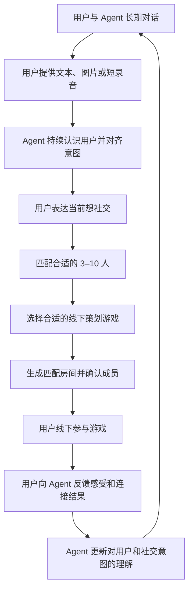

# TOMEET 产品流程

本文只描述用户和业务流程，不描述技术组件。

## 主流程

## 流程说明

1. 用户长期与 Agent 对话，并主动提供与自己相关的多模态信息。
2. Agent 持续理解用户，区分长期偏好和当前状态。
3. 用户明确表达想社交时，系统创建本次社交需求。
4. 系统根据本次意图原话与经过记忆治理的自然语言匹配叙事，匹配合适的 3–10 人，并选择一款人工策划的线下游戏；匹配不使用兴趣或性格标签。
5. 用户确认房间后，在线下完成游戏。
6. 活动结束后，用户向 Agent 表达对人、游戏和连接结果的感受。
7. Agent 使用反馈更新用户理解，影响下一次匹配和游戏选择。

## 业务边界

- Agent 不临时生成线下游戏。
- Agent 不在线主持线下游戏。
- 没有明确社交意图时，不创建匹配请求。
- 每次匹配使用当次社交意图，不直接使用长期画像代替当前意图。
- 匹配不使用兴趣标签、性格分类、人口属性或关键词重合，只使用本次意图和经过治理的连续自然语言 `matchingNarrative`。
