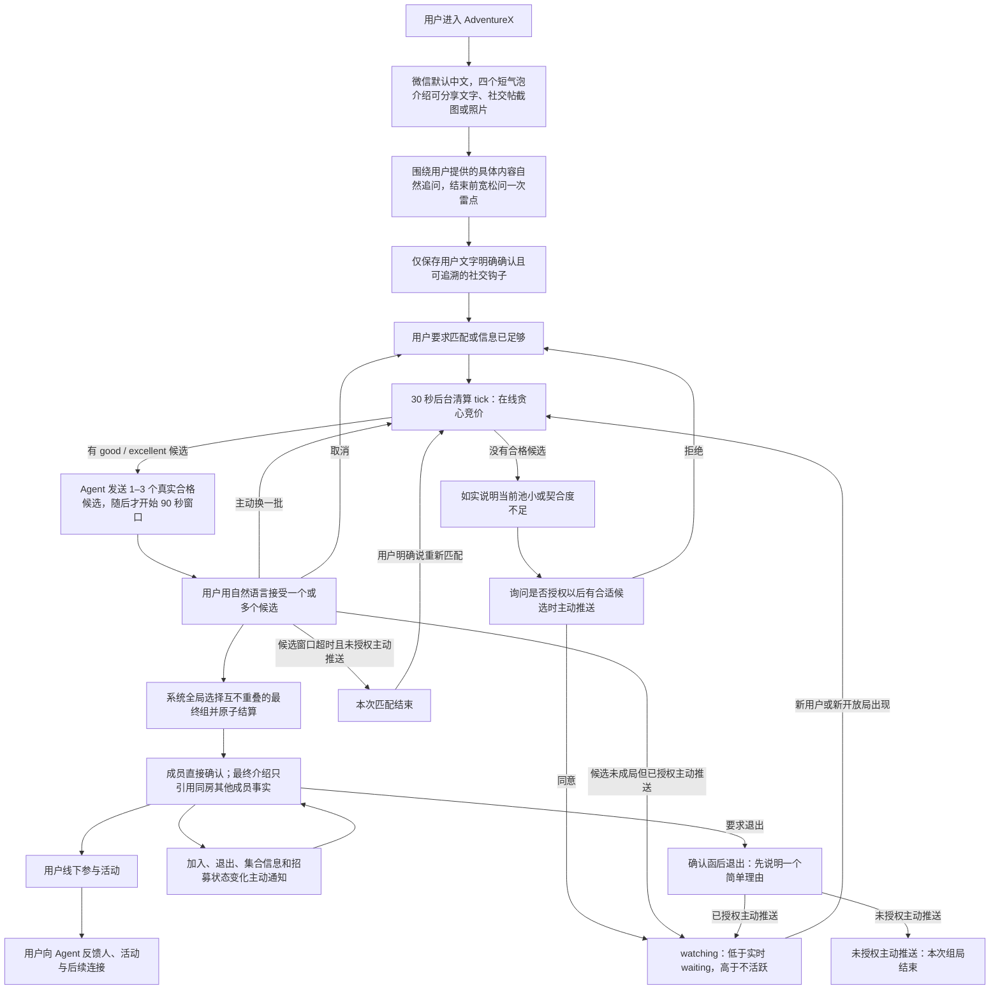

# TOMEET 产品流程

本文描述 AdventureX 活动现场多人组局 V1 的用户与业务流程。

## 主流程

```mermaid
flowchart TB
    Enter["用户进入 AdventureX"]
    Welcome["微信默认中文，四个短气泡介绍可分享文字、社交帖截图或照片"]
    Explore["围绕用户提供的具体内容自然追问，结束前宽松问一次雷点"]
    Hook["仅保存用户文字明确确认且可追溯的社交钩子"]
    Request["用户要求匹配或信息已足够"]
    Round["30 秒后台清算 tick：在线贪心竞价"]
    Options["Agent 发送 1–3 个真实合格候选，随后才开始 90 秒窗口"]
    Unavailable["如实说明当前池小或契合度不足"]
    Consent["询问是否授权以后有合适候选时主动推送"]
    Watching["watching：低于实时 waiting，高于不活跃"]
    Choice["用户用自然语言接受一个或多个候选"]
    Settle["系统全局选择互不重叠的最终组并原子结算"]
    Room["成员直接确认；最终介绍只引用同房其他成员事实"]
    ExitReason["确认函后退出：先说明一个简单理由"]
    ExitEnded["未授权主动推送：本次组局结束"]
    Change["加入、退出、集合信息和招募状态变化主动通知"]
    Offline["用户线下参与活动"]
    Feedback["用户向 Agent 反馈人、活动与后续连接"]

    Enter --> Welcome --> Explore --> Hook --> Request --> Round
    Round -->|有 good / excellent 候选| Options --> Choice --> Settle --> Room --> Offline --> Feedback
    Round -->|没有合格候选| Unavailable --> Consent
    Consent -->|同意| Watching
    Consent -->|拒绝| Request
    Watching -->|新用户或新开放局出现| Round
    Choice -->|主动换一批| Round
    Choice -->|候选窗口超时且未授权主动推送| Expired["本次匹配结束"]
    Choice -->|候选未成局但已授权主动推送| Watching
    Expired -->|用户明确说重新匹配| Round
    Choice -->|取消| Request
    Room --> Change --> Room
    Room -->|要求退出| ExitReason
    ExitReason -->|已授权主动推送| Watching
    ExitReason -->|未授权主动推送| ExitEnded
```

## 动态房间贪心流程

默认即时匹配路径按以下生命周期运行：

1. `user0` 发起匹配后，系统从队列中贪心选择当前最合适的 `user1`，只创建邀请，不提前建房。
2. `user0` 与 `user1` 双方接受后，系统在同一事务中建立 2 人房间。
3. 房间保持 `matchingStatus=active`。新用户进入队列时，系统优先在开放房间与候选用户之间贪心选择一个组合，每轮只发出一份入房邀请。
4. 候选用户接受后原子加入房间，系统继续寻找下一位；达到活动 `maxPlayers` 后自动标记 `full` 并停止。
5. 任一在房成员明确表达“停止匹配”“不要再加人”等语义时，房间标记 `stopped`，待处理邀请取消，候选请求重新入队。

所有邀请接受、拒绝、建房、加人、满员与停止操作均由数据库事务校验当前状态，避免并发重复建房或超员。

## 候选与成局事实边界

- 候选池中尚未确认的成员必须用不确定语气表达，不能写成已经参加。
- 开放局中的确认成员必须与可能参与的候选明确区分。
- 最终成员锁定后，只能引用同房其他已确认成员的可追溯事实。
- 图片观察不能直接成为社交钩子；所有钩子都必须绑定用户自己的文字消息。
- 用户因具体人物事实选择候选时，该人物未进入最终局则不自动改派；系统说明变化并结束本次请求，只有用户明确要求后才重新匹配。
- 没有生成真实候选时不启动 90 秒窗口，本轮立即结束。未授权用户进入 `push_consent`；同意后进入 `watching`，等待新用户或新开放局触发下一次清算。
- 已经收到候选但 90 秒内未选择时，本次具体尝试结束。未授权用户标记为 `expired`，Agent 告知如需继续可明确重新匹配；已授权用户回到 `watching`，不会把旧候选自动刷新成新一轮。
- 用户已经选择但候选最终未成局时，不按用户超时处理，也不向任何一方暴露谁拒绝或未确认。当前尝试明确结束；未授权用户进入 `push_consent`，已授权用户回到 `watching`。这类用户在后续 `watching` 候选中获得一次确认补位优先级，但仍低于当前实时 `waiting` 用户，且不会绕过 `good | excellent` 质量门槛。
- 正式成局确认函发出后，用户退出前必须给出任意非空理由；只说“退出”或“不去了”时，Agent 只追问一个简单理由，不执行退出。理由不做严格合理性判断，也不会发送给其他成员。退出后不询问重新匹配：已授权主动推送的请求回到 `matching/watching`，未授权请求变为 `cancelled`，两者都不会再次收到同一个开放局。

除首次 AdventureX 欢迎语外，候选、成局、超时、退出和变化通知都不在业务代码中拼固定回答。业务层只提交活动、人数、确认状态、人物事实和可用下一步等结构化事实；Hosted Agent 结合当前对话与记忆摘要生成最终措辞，再由发布前校验阶段删除无依据的标签、推断和状态升级。首次欢迎语是明确的硬编码产品例外，并通过语言级幂等键保证不会重复插入。微信默认中文；用户明确要求英文或切回中文时更新偏好并用对应语言重新播放欢迎语。

普通微信回复按一句话一个气泡发送，普通气泡结尾移除中文句号和英文句点，问号与感叹号保留。内容较多时按顺序逐个发送，并在气泡之间加入很短的可配置延迟。初步了解结束时，Agent 宽松地问一次用户有没有雷点或明确边界，不要求列清单，也不重复追问。

候选邀请与正式成局确认采用无右边框的左框字符卡片。邀请标题为 `TOMEET 组局邀请`，成局标题为 `TOMEET 成局确认函`；卡片保留顶部、分隔线、底部和左侧竖线，不使用右侧竖线、右上角或右下角，也不包 Markdown 代码围栏。整张卡片最多使用 2 个克制、功能性的 emoji，例如 `👥` 表示人数、`📍` 表示集合信息；不得逐行装饰。外框是固定呈现协议，卡片正文仍由 Hosted Agent 根据结构化事实和用户上下文生成，微信发送端将整张卡片保留为一个气泡。

## 开放局与变化通知

达到活动最低人数的房间可以成立，并在未达到目标人数或活动上限时保持 `open`。新用户匹配时，合适的开放局优先作为候选展示；接受后使用房间 `version` 原子加入。

用户明确接受候选后，以下用户可见变化必须通过 Agent 主动通知：成员加入或退出、关注人物退出、集合信息变化、房间取消、招募变为 full/closed。活动在有人确认后不可原地替换。

## 业务边界

- 当前所有用户都在 AdventureX 现场，不使用时间、地点、距离、年龄、性别等用户硬约束。
- Agent 不临时生成线下活动，只使用人工维护的活动目录。
- 匹配同时考虑人与人、人与活动、整组人与活动，不以兴趣标签、人格分类、人口属性、关键词重合或永久兼容分数代替判断。
- 匹配采用在线贪心竞价：`waiting` 用户优先，`watching` 用户用于补足或形成明显更好的组合；没有固定总人数 benchmark，但活动最低人数与 `good | excellent` 质量门槛必须满足。
- 候选数量是 1–3 个真实选项，不为了凑满三个降低质量或编造候选。
- 虚拟测试用户池按所有者隔离，只能由配置账号通过受保护开关启用，永远不会进入真实全局池。
- 用户最多进入一个最终局，且只能进入自己看过并明确接受的活动。
- 取消后保留审计历史；重新匹配创建新的 request，不复活旧请求。
- `ADVENTUREX_MATCHING_V1=false` 时保留旧即时匹配路径用于回滚。
